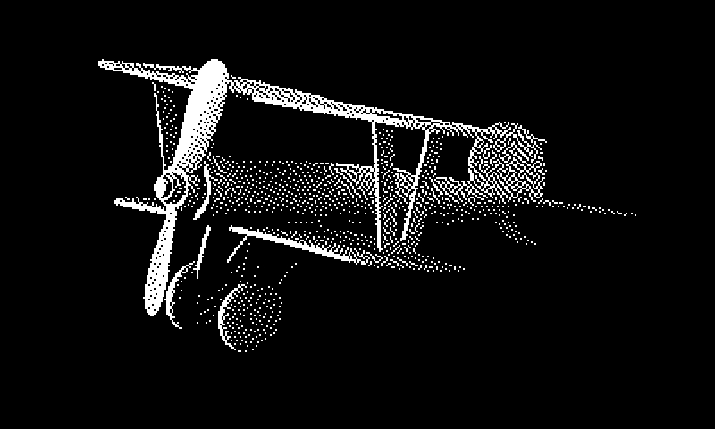
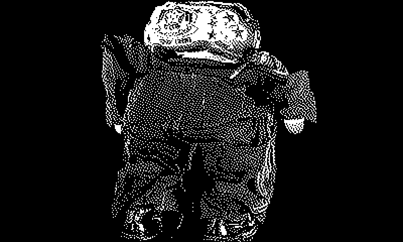

# go-wunderkammer-image

Go package for image-related operations in "wunderkammer" databases. 

## Important

This is work in progress.

## Tools

To build binary versions of these tools run the `cli` Makefile target. For example:

```
$> make cli
go build -mod vendor -o bin/append-dataurl cmd/append-dataurl/main.go
```

### append-dataurl

Update a stream of line-separated OEmbed JSON records to append a base64 encoded data URL to the `data_url` property. The source of the data URL is the value of the `url` property which will be fetched using an HTTP `GET` request.

```
$> ./bin/append-dataurl -h
Usage of ./bin/append-dataurl:
  -append-thumbnail
    	Append data URL for thumbnail_url if present. (default true)
  -auto-rotate
    	Auto-rotate image based on EXIF data
  -content-aware-height int
    	Content aware resizing to this height.
  -content-aware-resize
    	Enable content aware (seam carving) resizing.
  -content-aware-width int
    	Content aware resizing to this width.
  -dither
    	Dither (halftone) the final image.
  -format
    	Emit results as formatted JSON.
  -image-format string
    	Output format for encoded 'data_url' images. If empty then the content-type of the source image (defined in the 'url' property) will be used. (default "jpeg")
  -json
    	Emit results as a JSON array.
  -null
    	Emit to /dev/null
  -overwrite
    	Overwrite exisiting data_url properties
  -resize
    	Resize images to a maximum dimension (preserving aspect ratio).
  -resize-max-dimension int
    	Resize images to this maximum height or width (preserving aspect ratio).
  -strict
    	If true any error appending a data URL will stop execution.
  -stdout
    	Emit to STDOUT (default true)
  -timings
    	Log timings (time to wait to process, time to complete processing
  -workers int
    	The number of concurrent workers to append data URLs with (default {AVAILABLE CPUS})	
```

For example:

```
$> sqlite3 /usr/local/go-wunderkammer/nasm.db < /usr/local/go-wunderkammer/schema/sqlite/oembed.sql

$> /usr/local/go-smithsonian-openaccess/bin/emit \
	-oembed \
	-bucket-uri file:///Users/asc/code/OpenAccess metadata/objects/NASM \

   | /usr/local/go-wunderkammer-image/bin/append-dataurl \
	-timings \
	-dither \

   | /usr/local/go-wunderkammer/bin/wunderkammer-db \
	-database-dsn 'sql://sqlite3/usr/local/go-wunderkammer/nasm.db'

2020/07/14 09:04:40 Time to wait to process http://ids.si.edu/ids/deliveryService?id=NASM-A19670206000_PS01, 412ns
2020/07/14 09:04:40 Time to wait to process http://ids.si.edu/ids/deliveryService?id=NASM-NASM2011-00584, 254ns
2020/07/14 09:04:40 Time to wait to process https://ids.si.edu/ids/download?id=NASM-A19350058000-NASM2019-01744_screen, 112ns
2020/07/14 09:04:40 Time to wait to process https://ids.si.edu/ids/download?id=NASM-A19350058000-NASM2019-00617_screen, 162ns
2020/07/14 09:04:40 Time to wait to process https://ids.si.edu/ids/download?id=NASM-A19350058000-NASM2019-01743_screen, 111ns
2020/07/14 09:04:40 Time to wait to process https://ids.si.edu/ids/download?id=NASM-A19350058000-NASM2019-01745_screen, 90ns
2020/07/14 09:04:40 Time to wait to process https://ids.si.edu/ids/download?id=NASM-A19350058000-NASM2019-01747_screen, 100ns
2020/07/14 09:04:40 Time to wait to process https://ids.si.edu/ids/download?id=NASM-A19350058000-NASM2019-01748_screen, 109ns
2020/07/14 09:04:41 exif: failed to find exif intro marker
2020/07/14 09:04:42 Time to complete processing for http://ids.si.edu/ids/deliveryService?id=NASM-A19670206000_PS01, 1.446708455s
2020/07/14 09:04:42 Time to wait to process https://ids.si.edu/ids/download?id=NASM-A19350058000-NASM2019-01752_screen, 1.446648069s
2020/07/14 09:04:44 exif: failed to find exif intro marker
2020/07/14 09:04:44 exif: failed to find exif intro marker
2020/07/14 09:04:44 Time to complete processing for https://ids.si.edu/ids/download?id=NASM-A19350058000-NASM2019-01747_screen, 4.037780245s
2020/07/14 09:04:44 Time to wait to process https://ids.si.edu/ids/download?id=NASM-A19350058000-NASM2019-01758_screen, 2.591255228s
2020/07/14 09:04:44 Time to complete processing for https://ids.si.edu/ids/download?id=NASM-A19350058000-NASM2019-01744_screen, 4.184583514s
2020/07/14 09:04:44 Time to wait to process https://ids.si.edu/ids/download?id=NASM-A19350058000-NASM2019-01760_screen, 146.644379ms
...and so on
...time passes
2020/07/14 09:26:50 Time to process 2414 records, 22m23.069234259s

$> du -h /usr/local/go-wunderkammer/schema/sqlite/nasm.db
224M	nasm.db

$> sqlite3 /usr/local/go-wunderkammer/schema/sqlite/nasm.db
sqlite> SELECT * FROM oembed LIMIT 1;
http://ids.si.edu/ids/deliveryService?id=NASM-A19670206000_PS01|si://nasm/o/A19670206000|{"version":"1.0","type":"photo","width":-1,"height":-1,"title":"Space Food, Beef and Vegetables, Mercury, Friendship 7 (Transferred from NASA)","url":"http://ids.si.edu/ids/deliveryService?id=NASM-A19670206000_PS01","author_name":"John H. Glenn, Jr.","author_url":"https://airandspace.si.edu/collection/id/nasm_A19670206000","provider_name":"National Air and Space Museum","provider_url":"https://airandspace.si.edu","object_uri":"si://nasm/o/A19670206000","data_url":"data:image/jpeg;base64,R0lGODlhTgTQB4cAAAAAAAAARAAAiAAAzABEAA... and so om
```

#### Content aware resizing

Content aware resizing (seam carving) is done using the [esimov/caire](https://github.com/esimov/caire) package. It is not fast and will make your computer's fan go `WHIIIIIIIRRRRRRRRRRRRR` (it's doing a lot of work).

For example, here's what you would do to resize all the images to fit a 800x480 pixel display:

```
$> sqlite3 /usr/local/go-wunderkammer/nasm.db < /usr/local/go-wunderkammer/schema/sqlite/oembed.sql

$> /usr/local/go-smithsonian-openaccess/bin/emit \
	-oembed \
	-bucket-uri file:///Users/asc/code/OpenAccess metadata/objects/NASM \

   | /usr/local/go-wunderkammer/bin/append-dataurl \
	-dither \
	-content-aware-resize \
	-content-aware-height 480 \
	-content-aware-width 800

   | /usr/local/go-wunderkammer/bin/wunderkammer-db \
	-database-dsn 'sql://sqlite3/usr/local/go-wunderkammer/nasm.db'

...time passes (easily hours, go get a coffee or something)
...and your computer's fan goes WHHHHHHHIIIIIIRRRRRRR!!!!
```

Content-aware resizing currently doesn't [check to see whether content-aware resizing _shouldn't_ be applied](https://github.com/aaronland/go-wunderkammer/issues/1). For example when the aspect ratio of the input image is different than the aspect ratio of the resized content.

For example, content-aware resizing makes sense for this image:



But maybe not for this one:



## See also

* https://github.com/search?q=topic%3Awunderkammer+org%3Aaaronland&type=Repositories